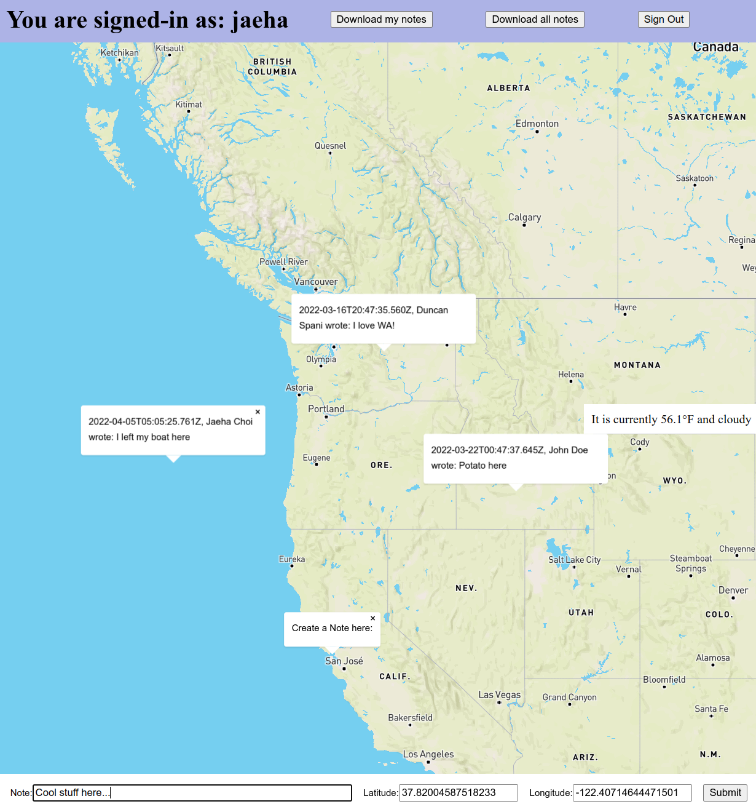
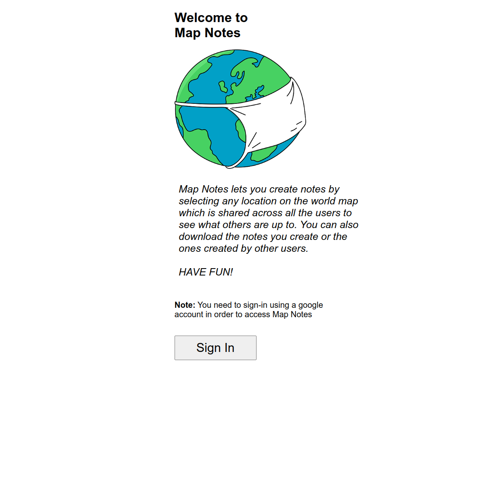

# Map Notes

#### Authors: Jay, Jaeha, Mehak, Duncan

README created by: Jay Lin


Website URL: http://prog5.azurewebsites.net/





## Summary

This is a Django (Python-based framework) application that provides a map view of notes saved around the world. Users
can write and save notes, then select whichever location on the world map they would like the note to be attached to.

## Requirements

- Python 3.10
    - System with python may require `python3` or `python3.10` instead of `python` when using commandline interface.
- PostgreSQL header/library
    - Ubuntu: `apt install libpq-dev`
    - Arch: `pacman -S postgresql-libs`
- Azure Database for PostgreSQL
    - Set environment variables to pass credentials (see [Quickstart](#Quickstart) #4)
- Optional
    - `venv` (or `virtualenv`): Python Virtual environment is recommended to prevent dependency conflicts.
      See [official document](https://docs.python.org/3/library/venv.html) for more information.
- Packages in `requirements.txt`
- setup.sh (to configure the secrets/env variables if testing locally)

## Quickstart

1. Clone this project
    - `git clone https://github.com/jaeha-choi/CSS436_Program_5 && cd CSS436_Program_5`
2. (Optional) Create/Activate `venv`
    1. Create `venv` in current directory if you haven't already
        - `python -m venv venv` or `virtualenv ~/virt`
    2. Activate `venv`
        - Linux/macOS (bash/zsh): `source venv/bin/activate` or `source ~/virt/bin/activate`
        - Windows (CMD): `venv\Scripts\activate.bat`
        - Windows (PS): `venv\Scripts\Activate.ps1`
    3. Verify `venv`
        - Linux/macOS: `where python`
        - Windows: `which python`
3. Install python package dependencies
    - `pip install -r requirements.txt`
4. Set environment variables (without `<`, `>`)
    ```shell
    # Azure Database
    PROJ_5_DB_HOST=<server_name>.postgres.database.azure.com
    PROJ_5_DB_USERNAME=<username>
    PROJ_5_DB_PASSWORD=<password>
    PROJ_5_DB_NAME=<db_name>
    
    # Django
    PROG_5_DJANGO_SECRET_KEY=<secret_key>
     ```
5. Create database if you haven't
    - `createdb -h <host> -U <user> <db_name>`
6. Run server
    - Use default settings: `python manage.py runserver`
    - Use `0.0.0.0` as host and `8080` as port: `python manage.py runserver 0.0.0.0:8080`

Type CTRL+C when you want to stop the local web server.

## Project Structure

Below is a tree of the current project. Files of note have comments in parentheses next to their names. Files without
comments you don't need to worry about on a basic level.

```
CSS436_Program_5
├── .gitignore
├── manage.py (command-line utility for administrative tasks)
├── mapnotes (houses our actual application)
│   ├── admin.py
│   ├── apps.py
│   ├── __init__.py
│   ├── migrations (for migrating the data)
│   │   ├── 0001_initial.py
│   │   └── __init__.py
│   ├── models.py (where we setup the database schema)
│   ├── templates
│   │   └── mapnotes
│   │       ├── feed.html (list of all notes)
│   │       ├── index.html (main page showing the map)
│   │       └── user.html (shows 1 specific user)
│   ├── tests.py
│   ├── urls.py (specify app-specific URL locations)
│   └── views.py (how the pages' UI look)
├── mysite (configure project-wide settings)
│   ├── asgi.py
│   ├── __init__.py
│   ├── settings.py (application settings, modules, databases...etc)
│   ├── urls.py (specify project-wide URL locations)
│   └── wsgi.py
├── Procfile
├── README.md
└── requirements.txt
```

## Static files

Django static files include images, CSS, and Javascript files. For easy deployment, they can be gathered into a single
directory (project-wide) so they can be easily served. To do this and generate a staticfiles folder, specify STATIC_ROOT
= "some_path" in settings.py, then run `python3 manage.py collectstatic`.

## Database Management

This application uses PostgreSQL (SQL or relational database).

- If models have changed:
    - Run `python manage.py makemigrations mapnotes` to tell Django that we changed up our models in
      mapnotes/models.py (ex: need to create new tables).
    - `python manage.py migrate` to apply those changes.
    - Open interactive shell: `python manage.py shell`
    - See [Django tutorial](https://docs.djangoproject.com/en/4.0/intro/tutorial02/) for more details.
- Connecting to PostgreSQL CLI
    - Using `psql`
        - Default settings: `psql -h <host> -U <username> [db_name]`
        - With port specified: `psql -h <host> -p <port> -U <username> [db_name]`
    - Using Azure CLI
        - Install azure-cli via command line (ex: `brew install azure-cli`)
        - Login with your account using `az login`
        -
      Type: `az postgres flexible-server connect -n postgresdemoserver -u dbuser -p "dbpassword" -d flexibleserverdb --interactive`
      Source: https://docs.microsoft.com/en-us/azure/postgresql/flexible-server/connect-azure-cli
        - This will start an interactive session in the Azure PostgreSQL server
            - DROP DATABASE notes; CREATE DATABASE notes;
            - Go back to your application and do python3 manage.py migrate. This will push the schema changes to Azure.

## Miscellaneous

- Site ID: to check the list of sites, open a python shell and type: `from django.contrib.sites.models import Site`,
  then `sorted([(site.id,site.name) for site in Site.objects.all()])` to view a list of all sites with IDs and their
  names.

### Heroku

See: https://devcenter.heroku.com/categories/working-with-django

- ``heroku pg:psql`` to connect to heroku postgres locally via CLI. You must have the heroku CLI installed.
- ``heroku run python manage.py shell`` run python interactive on the live heroku server
- ``heroku run python manage.py createsuperuser`` create a super user on live heroku server
- ``git push heroku local-branch-name:main `` to push and deploy changes

### Other very helpful sources

- Parse JSON in script given a
  context: https://stackoverflow.com/questions/3345076django-parse-json-in-my-template-using-javascript
